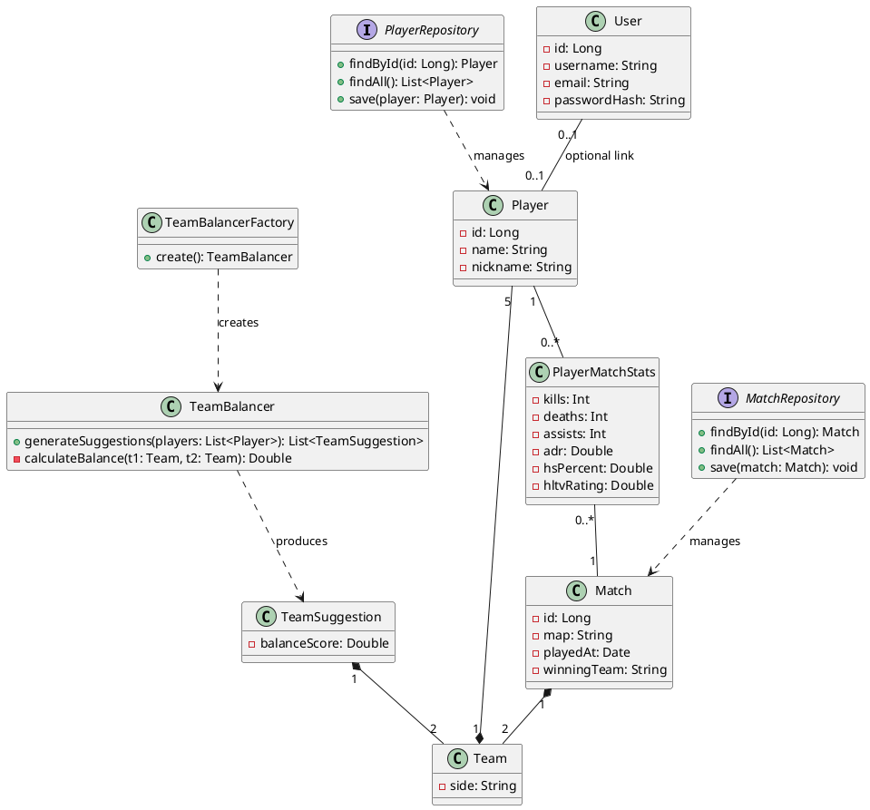

# FSA2026-Kubik

## Zadanie od zákazníka

Naša firma potrebuje systém na správu a sledovanie odohraných zápasov. Do systému bude možné zadávať výsledky zápasov, ktoré sa odohrali, a systém bude schopný generovať štatistiky a reporty o výkonnosti hráčov. Jednou z hlavných funkcionalít ktorá je požadovaná je možnosť generovať nové vyrovnané tímy na základe zadaných hráčov a ich výkonnosti.

## 1. Požiadavky

### Funkčné požiadavky

1. Systém umožňuje pridávanie hráčov (meno, prezývka).
2. Systém umožňuje zaznamenávať odohraté zápasy vrátane mapy, výsledku a zúčastnených hráčov.
3. Pre každý zápas systém uchováva štatistiky každého hráča: kills, deaths, assists, ADR, HS%, HLTV rating.
4. Systém zobrazuje agregované štatistiky hráčov naprieč všetkými zápasmi.
5. Systém dokáže generovať návrhy vyrovnaných tímov na základe výkonnosti hráčov.
6. Používateľ si môže vybrať jeden z vygenerovaných návrhov rozdelenia tímov.
7. Používateľ si môže prepojiť svoj účet s existujúcim hráčskym profilom na základe prezývky. Toto prepojenie je voliteľné na oboch stranách.

### Nefunkčné požiadavky

1. Štatistiky hráčov sa aktualizujú ihneď po pridaní zápasu.
2. Algoritmus generovania tímov produkuje viacero variantov (min. 3) na výber.

---

## 2. Slovník pojmov

| Pojem                                   | Definícia                                                                           |
| --------------------------------------- | ----------------------------------------------------------------------------------- |
| **Používateľ** (User)                   | Osoba s účtom v systéme; môže, ale nemusí byť hráčom v zápasoch                     |
| **Hráč** (Player)                       | Entita reprezentujúca účastníka zápasov; existuje nezávisle od používateľského účtu |
| **Zápas** (Match)                       | Odohraná hra, zaznamenaná v systéme                                                 |
| **Mapa** (Map)                          | CS2 herná mapa, na ktorej sa zápas odohral                                          |
| **Výsledok** (Result)                   | Víťaz zápasu (tím CT alebo tím T)                                                   |
| **Štatistiky hráča** (PlayerMatchStats) | Výkonnostné údaje hráča v konkrétnom zápase: K/D/A, ADR, HS%, HLTV rating           |
| **HLTV rating**                         | Štandardizovaná metrika výkonnosti hráča v CS2                                      |
| **ADR**                                 | Average Damage per Round - priemerný damage za kolo                                 |
| **HS%**                                 | Headshot percentage - percento zabití hlavou                                        |
| **Tím** (Team)                          | Skupina 5 hráčov vytvorená pre jeden zápas                                          |
| **Generovanie tímov**                   | Algoritmus, ktorý rozdeľuje skupinu hráčov do dvoch vyrovnaných tímov               |
| **Návrh rozdelenia** (TeamSuggestion)   | Jeden konkrétny variant rozdelenia hráčov do dvoch tímov                            |

---

## 3. Prípady použitia (Use Cases)

### Zoznam UC

- UC1: Pridať hráča
- UC2: Zaznamenať zápas
- UC3: Zobraziť štatistiky hráča
- UC4: Generovať návrhy tímov
- UC5: Vybrať návrh tímu
- UC6: Zobraziť históriu zápasov
- UC7: Prepojiť účet s hráčom

---

### UC1: Pridať hráča

- **Aktér:** Používateľ
- **Predpodmienka:** -
- **Hlavný tok:**
  1. Používateľ naviguje na sekciu hráčov.
  2. Klikne na tlačidlo „Pridať hráča".
  3. Systém zobrazí formulár s poľami: meno, prezývka.
  4. Používateľ vyplní meno a prezývku hráča.
  5. Používateľ odošle formulár.
  6. Systém overí, že všetky povinné polia sú vyplnené.
  7. Systém overí, že zadaná prezývka ešte neexistuje v databáze.
  8. Systém vytvorí nový záznam `Player` a uloží ho.
  9. Systém zobrazí potvrdzovaciu správu a nového hráča v zozname.
- **Alternatívny tok A - chýbajúce pole:**
  - V kroku 6: Ak niektoré povinné pole nie je vyplnené, systém zvýrazní dané pole a zobrazí chybovú hlášku. Používateľ opraví vstup a znovu odošle (návrat na krok 5).
- **Alternatívny tok B - duplicitná prezývka:**
  - V kroku 7: Ak prezývka už existuje, systém zobrazí hlášku „Prezývka je už obsadená" a vyzve používateľa na zadanie inej (návrat na krok 4).
- **Následok:** Hráč je uložený v systéme a je dostupný na výber pri zadávaní zápasov.

---

### UC2: Zaznamenať zápas

- **Aktér:** Používateľ
- **Predpodmienka:** V systéme existuje aspoň 10 hráčov.
- **Hlavný tok:**
  1. Používateľ naviguje na sekciu zápasov a klikne na „Pridať zápas".
  2. Systém zobrazí formulár pre nový zápas.
  3. Používateľ vyberie mapu zo zoznamu dostupných CS2 máp.
  4. Používateľ vyberie dátum a čas odohratia zápasu.
  5. Používateľ priradí 5 hráčov do tímu CT a 5 hráčov do tímu T výberom zo zoznamu existujúcich hráčov.
  6. Systém overí, že žiadny hráč nie je zvolený v oboch tímoch súčasne.
  7. Používateľ zadá štatistiky pre každého hráča: kills, deaths, assists, ADR, HS%, HLTV rating.
  8. Používateľ zadá výsledné skóre pre oboje tímy.
  9. Používateľ odošle formulár.
  10. Systém overí, že všetky štatistiky sú vyplnené a majú platné hodnoty (napr. kills ≥ 0, HS% ∈ ⟨0, 100⟩).
  11. Systém uloží záznam `Match` spolu s dvoma `Team` entitami a príslušnými `PlayerMatchStats` záznamami.
  12. Systém zobrazí potvrdenie a presmeruje používateľa na detail zápasu.
- **Alternatívny tok A - neplatné štatistiky:**
  - V kroku 10: Ak niektorá hodnota je mimo povoleného rozsahu, systém zvýrazní dané pole a zobrazí chybovú hlášku. Používateľ opraví hodnotu (návrat na krok 7).
- **Alternatívny tok B - duplicitný hráč v tímoch:**
  - V kroku 6: Ak je hráč vybraný v oboch tímoch, systém ho z druhého výberu automaticky odstráni a upozorní používateľa.
- **Alternatívny tok C - nedostatok hráčov:**
  - Ak v systéme nie je dostatok hráčov, formulár zobrazí upozornenie a odkaz na UC1.
- **Následok:** Zápas je uložený, štatistiky všetkých 10 hráčov sú aktualizované.

---

### UC4: Generovať návrhy tímov

- **Aktér:** Používateľ
- **Predpodmienka:** V systéme existuje aspoň 10 hráčov, pričom každý má odohraný aspoň 1 zápas so zaznamenanou štatistikou.
- **Hlavný tok:**
  1. Používateľ naviguje na sekciu „Generovanie tímov".
  2. Systém zobrazí zoznam všetkých dostupných hráčov s ich priemerným HLTV ratingom.
  3. Používateľ vyberie presne 10 hráčov, ktorí sa zúčastnia hry.
  4. Používateľ klikne na „Generovať tímy".
  5. Systém načíta priemerné štatistiky (HLTV rating, ADR, K/D ratio) pre každého z vybraných hráčov.
  6. `TeamBalancer` vypočíta všetky možné kombinácie rozdelenia a vyberie min. 3 návrhy s najvyšším skóre vyrovnanosti.
  7. Systém zobrazí návrhy - pre každý návrh zobrazí zloženie oboch tímov, priemerný rating tímu a celkové skóre vyrovnanosti.
  8. Používateľ si prezrie návrhy a pokračuje na UC5 (výber návrhu).
- **Alternatívny tok A - hráč bez štatistík:**
  - V kroku 5: Ak niektorý z vybraných hráčov nemá žiadne odohraté zápasy, systém ho označí ako „bez histórie" a použije neutrálne priemerné hodnoty. Používateľ je o tom informovaný upozornením.
- **Alternatívny tok B - menej ako 10 vybraných hráčov:**
  - V kroku 4: Systém zobrazí validačnú chybovú hlášku „Je potrebné vybrať presne 10 hráčov" a neumožní generovanie.
- **Následok:** Používateľ vidí min. 3 návrhy tímov zoradené podľa skóre vyrovnanosti a môže si jeden vybrať (UC5).

---

### UC7: Prepojiť účet s hráčom

- **Aktér:** Používateľ (prihlásený)
- **Predpodmienka:** Používateľ má vytvorený a overený účet a nie je ešte prepojený so žiadnym hráčom.
- **Hlavný tok:**
  1. Používateľ otvorí nastavenia svojho profilu.
  2. Systém zobrazí sekciu „Prepojiť s hráčskym profilom" s vyhľadávacím poľom.
  3. Používateľ zadá prezývku hráča, ktorého profil chce prepojiť.
  4. Systém vyhľadá záznamy `Player` zodpovedajúce zadanej prezývke.
  5. Systém zobrazí nájdený profil hráča vrátane jeho mena a počtu odohraných zápasov.
  6. Používateľ skontroluje zobrazené informácie a klikne na „Potvrdiť prepojenie".
  7. Systém nastaví `User.player` na nájdený záznam `Player`.
  8. Systém zobrazí potvrdenie prepojenia a od tejto chvíle sú historické štatistiky hráča dostupné priamo cez používateľský účet.
- **Alternatívny tok A - prezývka nenájdená:**
  - V kroku 4: Ak žiadny hráč s danou prezývkou neexistuje, systém zobrazí hlášku „Hráč s touto prezývkou nebol nájdený". Používateľ môže zadať inú prezývku (návrat na krok 3) alebo najprv vytvoriť hráča (UC1).
- **Alternatívny tok B - hráč je už prepojený s iným účtom:**
  - V kroku 7: Ak je daný `Player` už prepojený s iným `User` účtom, systém odmietne prepojenie a zobrazí príslušnú hlášku.
- **Alternatívny tok C - zrušenie prepojenia:**
  - Ak používateľ už prepojenie má a chce ho zrušiť, systém ponúkne možnosť „Odpojiť profil". Po potvrdení je `User.player` nastavený na `null`.
- **Následok:** Účet je prepojený s hráčskym profilom; štatistiky hráča sú zobrazované v kontexte používateľského účtu.

---

## 4. Doménový model

### PlantUML

